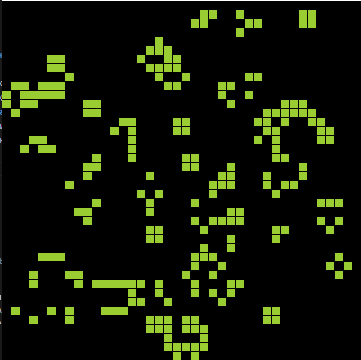

# Игра «Жизнь» — Паттерн Toad (MonoGame)

## Цель работы

Цель данной лабораторной работы — научиться моделировать клеточный автомат «Игра Жизнь», исследовать процессы самоорганизации и возникновение сложных структур в системе с простыми локальными правилами. Дополнительно требуется реализовать осцилляторный паттерн **Toad** на фоне случайно сгенерированной сетки размером **40×40**, чтобы наблюдать взаимодействие организованных структур с хаотической средой.

---

## Описание работы программы

Программа реализована с использованием фреймворка **MonoGame** — это библиотека на C# для создания 2D/3D графики и игр.  
Каждая клетка сетки представлена квадратом на экране. Живые клетки окрашены в белый цвет, мёртвые — в чёрный.  
Каждый кадр игры представляет собой один шаг эволюции клеточного автомата.

Сетка обновляется по правилам Конвея:
1. Живая клетка с <2 живыми соседями умирает (одиночество).  
2. Живая клетка с 2–3 живыми соседями выживает.  
3. Живая клетка с >3 живыми соседями умирает (перенаселение).  
4. Мёртвая клетка с ровно 3 живыми соседями оживает (размножение).

---

## Структура проекта

```
GameOfLifeToad/
│
├── Game1.cs           # Основная логика MonoGame
├── Program.cs         # Точка входа
├── Content/           # Каталог ресурсов (текстуры, шрифты, если нужны)
└── README.md          # Описание проекта
```

---

## Реализация логики клеточного автомата

Основная идея заключается в хранении текущего и следующего состояния сетки. После применения правил, старая сетка заменяется новой.

```csharp
const int gridSize = 40;
bool[,] grid = new bool[gridSize, gridSize];
bool[,] nextGrid = new bool[gridSize, gridSize];
Random rand = new Random();

void InitializeGrid()
{
    for (int y = 0; y < gridSize; y++)
    {
        for (int x = 0; x < gridSize; x++)
        {
            // Случайное распределение живых клеток (20–50%)
            grid[y, x] = rand.NextDouble() < 0.35;
        }
    }

    // Добавляем паттерн Toad (осциллятор)
    AddToadPattern(10, 10);
}

void AddToadPattern(int startX, int startY)
{
    // Структура Toad:
    //  0 1 1 1
    //  1 1 1 0
    grid[startY, startX + 1] = true;
    grid[startY, startX + 2] = true;
    grid[startY, startX + 3] = true;
    grid[startY + 1, startX] = true;
    grid[startY + 1, startX + 1] = true;
    grid[startY + 1, startX + 2] = true;
}
```

---

## Правила обновления клеток

```csharp
int CountNeighbors(int x, int y)
{
    int count = 0;
    for (int dy = -1; dy <= 1; dy++)
    {
        for (int dx = -1; dx <= 1; dx++)
        {
            if (dx == 0 && dy == 0) continue;
            int nx = x + dx;
            int ny = y + dy;
            if (nx >= 0 && nx < gridSize && ny >= 0 && ny < gridSize)
                if (grid[ny, nx]) count++;
        }
    }
    return count;
}

void UpdateGrid()
{
    for (int y = 0; y < gridSize; y++)
    {
        for (int x = 0; x < gridSize; x++)
        {
            int neighbors = CountNeighbors(x, y);

            if (grid[y, x])
                nextGrid[y, x] = neighbors == 2 || neighbors == 3;
            else
                nextGrid[y, x] = neighbors == 3;
        }
    }

    // Обновляем текущее состояние
    Array.Copy(nextGrid, grid, grid.Length);
}
```

---

## Отрисовка сетки

MonoGame используется для визуализации. Каждый кадр очищается и перерисовывается новая сетка.

```csharp
protected override void Draw(GameTime gameTime)
{
    GraphicsDevice.Clear(Color.Black);
    spriteBatch.Begin();

    int cellSize = 15;
    for (int y = 0; y < gridSize; y++)
    {
        for (int x = 0; x < gridSize; x++)
        {
            if (grid[y, x])
                spriteBatch.Draw(pixel, new Rectangle(x * cellSize, y * cellSize, cellSize - 1, cellSize - 1), Color.White);
        }
    }

    spriteBatch.End();
    base.Draw(gameTime);
}
```

---

## Наблюдения и результаты

После запуска симуляции можно наблюдать:
- случайное распределение живых и мёртвых клеток, создающее динамичный фон;  
- паттерн **Toad**, который является **осциллятором** с периодом 2, устойчиво колеблющимся между двумя состояниями;  
- взаимодействие Toad с хаотичными соседними клетками, что иногда приводит к его разрушению или искажению формы;  
- появление новых устойчивых фигур и глайдеров, возникающих из случайной среды.



---

## Выводы

1. Простые локальные правила, заданные для клеток, способны формировать сложное глобальное поведение.  
2. Осцилляторы, такие как Toad, демонстрируют устойчивость и периодичность даже на фоне случайного окружения.  
3. Клеточные автоматы можно рассматривать как модель самоорганизующихся систем, где порядок и хаос сосуществуют.  
4. Использование **MonoGame** позволяет визуализировать эволюцию клеточного автомата в реальном времени, что делает исследование более наглядным.  
5. Данная работа иллюстрирует связь клеточных автоматов с концепциями искусственного интеллекта и многоагентных систем — каждая клетка действует автономно, но их взаимодействие формирует коллективное поведение.

